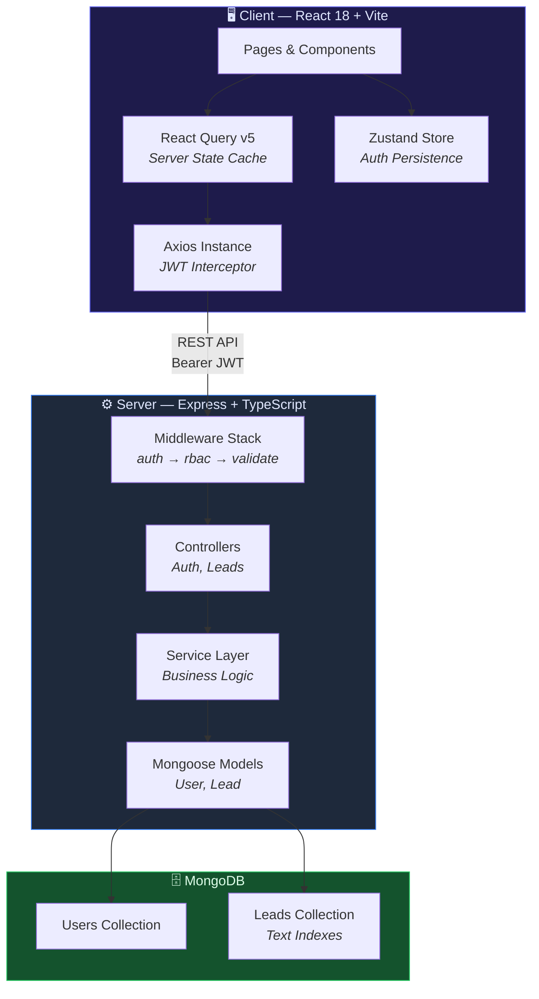
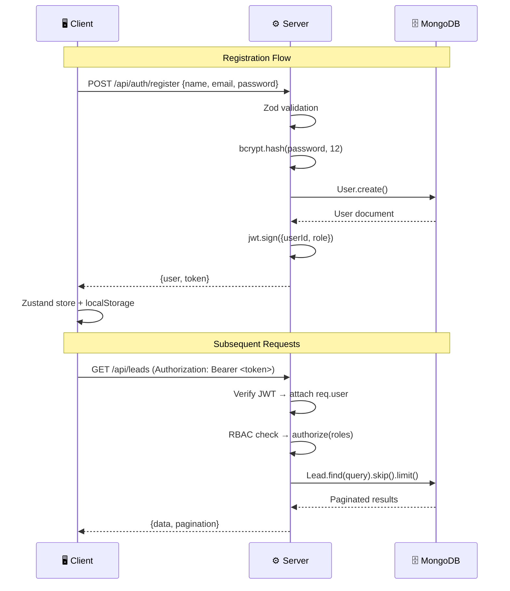
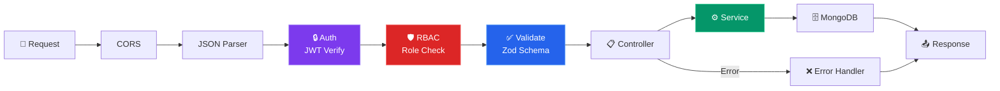
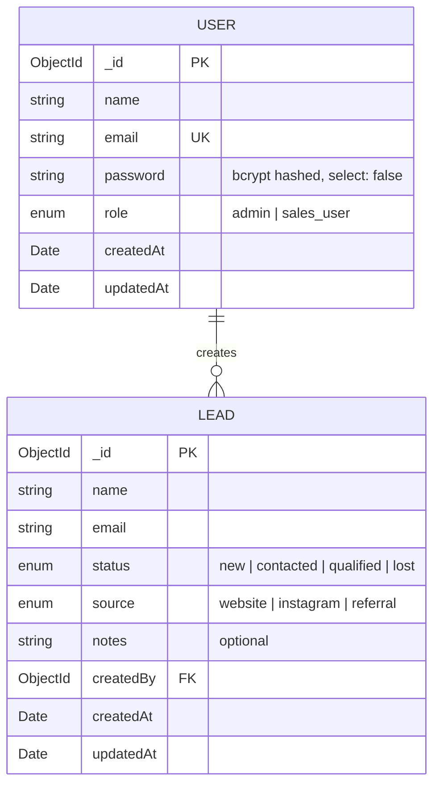

<p align="center">
  
  
  
  
  
  
</p>

<h1 align="center">⚡ Smart Leads Dashboard</h1>

<p align="center">
  <strong>A production-grade Lead Management System built with the MERN stack & TypeScript</strong>
  <br />
  <em>Full CRUD • RBAC • JWT Auth • Real-time Search • CSV Export • Docker Ready</em>
</p>

<p align="center">
  <a href="#-quick-start">Quick Start</a> •
  <a href="#-architecture">Architecture</a> •
  <a href="#-features">Features</a> •
  <a href="#-api-documentation">API Docs</a> •
  <a href="#-deployment">Deployment</a>
</p>

---

## 🏗️ Architecture

### System Overview



### Authentication Flow



### Request Pipeline



### Data Model (ERD)



---

## 🎯 Features

| Category | Feature | Implementation |
|----------|---------|----------------|
| **Auth** | JWT Authentication | Register, login, auto-logout on expiry |
| **Auth** | Role-Based Access | `admin` (full CRUD) vs `sales_user` (read-only) |
| **Auth** | Password Security | bcrypt hashing, 12 salt rounds, `select: false` |
| **CRUD** | Lead Management | Create, read, update, delete with validation |
| **CRUD** | Lead Detail View | Slide-over panel with full lead information |
| **Search** | Debounced Search | 300ms debounce on name/email (regex, case-insensitive) |
| **Filter** | Composable Filters | Status + Source + Sort — all combinable simultaneously |
| **Pagination** | Server-side | `skip/limit` with metadata: `{total, page, limit, totalPages}` |
| **Export** | CSV Download | Backend generation + browser file download |
| **UI** | Dark Mode | System preference detection + manual toggle + persisted |
| **UI** | Loading States | Skeleton rows with staggered animation delays |
| **UI** | Error Handling | Error boundaries, contextual error cards, recovery actions |
| **UI** | Empty States | Descriptive empty state illustrations |
| **UI** | Responsive | Mobile-first, collapsible sidebar, adaptive layouts |
| **Forms** | Dual Validation | Client (Zod + react-hook-form) + Server (Zod) |
| **Infra** | Docker Compose | One-command full-stack deployment (3 services) |
| **DX** | Strict TypeScript | Zero `any` usage (except justified Mongoose transform) |

---

## 🛠️ Tech Stack

| Layer | Technology | Purpose |
|-------|-----------|---------|
| **Frontend** | React 18 + TypeScript | Component-based SPA |
| **Build** | Vite 6 | HMR, tree-shaking, proxy |
| **Styling** | TailwindCSS 3 | Utility-first CSS with `darkMode: 'class'` |
| **State** | Zustand 5 | Lightweight, persisted client store |
| **Server Cache** | React Query v5 | Data fetching, caching, mutations |
| **Forms** | react-hook-form + Zod | Performant forms with schema validation |
| **Icons** | Lucide React | Consistent, tree-shakeable icons |
| **Notifications** | react-hot-toast | Minimal toast notifications |
| **Backend** | Express.js + TypeScript | REST API server |
| **Database** | MongoDB 7 + Mongoose | Document store with text indexes |
| **Auth** | jsonwebtoken + bcryptjs | Stateless JWT authentication |
| **Validation** | Zod | Runtime schema validation (both ends) |
| **Infra** | Docker + Docker Compose | Container orchestration |
| **Production** | Nginx (Alpine) | SPA routing + API reverse proxy |

---

## 🚀 Quick Start

### Prerequisites

- **Node.js** ≥ 18 &nbsp;|&nbsp; **MongoDB** running locally &nbsp;|&nbsp; **npm**

### Local Development

```bash
# 1. Clone
git clone https://github.com/your-username/smart-leads-dashboard.git
cd smart-leads-dashboard

# 2. Setup environment
cp .env.example .env

# 3. Start server (Terminal 1)
cd server
npm install
npm run dev          # → http://localhost:5000

# 4. Start client (Terminal 2)
cd client
npm install
npm run dev          # → http://localhost:5173

# 5. Seed database (Terminal 3 — one-time)
cd server
npm run seed
```

### Docker (One-Command)

```bash
cp .env.example .env
docker-compose up --build

# Client  → http://localhost:3000
# API     → http://localhost:5000/api
# MongoDB → localhost:27017
```

### Demo Credentials

| Role | Email | Password | Access |
|------|-------|----------|--------|
| **Admin** | `admin@smartleads.com` | `admin123` | Full CRUD + Export |
| **Sales** | `sales@smartleads.com` | `sales123` | Read-only + Export |

---

## 📁 Project Structure

```
smart-leads-dashboard/
│
├── client/                          # React 18 + Vite Frontend
│   ├── src/
│   │   ├── api/
│   │   │   └── axiosInstance.ts     # Axios + JWT interceptor + 401 auto-logout
│   │   ├── components/
│   │   │   ├── layout/              # Sidebar, Navbar, DashboardLayout, ProtectedRoute
│   │   │   ├── leads/               # LeadsTable, LeadForm, LeadFiltersBar, LeadDetail
│   │   │   └── ui/                  # StatusBadge, SourceBadge, Pagination, Modal,
│   │   │                            # SlideOver, SkeletonRows, ErrorBoundary
│   │   ├── hooks/                   # useDebounce, useLeads, useDarkMode
│   │   ├── pages/                   # Login, Register, Dashboard, Leads, Settings
│   │   ├── store/                   # Zustand auth store (persisted)
│   │   ├── types/                   # TypeScript interfaces (lead, auth)
│   │   └── utils/                   # exportCsv, formatDate
│   ├── tailwind.config.ts           # Custom brand/surface color tokens + animations
│   ├── nginx.conf                   # Production SPA + API proxy
│   └── Dockerfile                   # Multi-stage: build → nginx:alpine
│
├── server/                          # Express + TypeScript Backend
│   ├── src/
│   │   ├── config/db.ts             # Mongoose connection with retry
│   │   ├── controllers/             # authController, leadsController
│   │   ├── middleware/              # auth (JWT), rbac, validate (Zod), errorHandler
│   │   ├── models/                  # User (bcrypt), Lead (text index)
│   │   ├── routes/                  # auth.routes, leads.routes
│   │   ├── services/               # leadService (composable query builder)
│   │   ├── types/                  # Shared TS interfaces
│   │   ├── utils/                  # ApiError, jwt, csvExport, paginate
│   │   ├── validators/            # Zod schemas (auth, lead)
│   │   └── seed.ts                # Database seeder (2 users + 15 leads)
│   ├── tsconfig.json
│   └── Dockerfile                 # Multi-stage: build → node:20-alpine
│
├── docker-compose.yml             # MongoDB + Server + Client orchestration
├── .env.example                   # Environment template (no secrets)
└── README.md
```

---

## 📡 API Documentation

### Base URL: `http://localhost:5000/api`

### Auth Endpoints

| Method | Endpoint | Body | Auth | Description |
|--------|----------|------|:----:|-------------|
| `POST` | `/auth/register` | `{ name, email, password, role? }` | — | Create account, return JWT |
| `POST` | `/auth/login` | `{ email, password }` | — | Authenticate, return JWT |
| `GET` | `/auth/me` | — | 🔒 | Get current user profile |

### Lead Endpoints

| Method | Endpoint | Auth | Role | Description |
|--------|----------|:----:|------|-------------|
| `GET` | `/leads` | 🔒 | All | List leads (filterable + paginated) |
| `GET` | `/leads/stats` | 🔒 | All | Aggregated dashboard statistics |
| `GET` | `/leads/export` | 🔒 | All | Download filtered leads as CSV |
| `GET` | `/leads/:id` | 🔒 | All | Single lead detail |
| `POST` | `/leads` | 🔒 | Admin | Create new lead |
| `PUT` | `/leads/:id` | 🔒 | Admin | Update lead |
| `DELETE` | `/leads/:id` | 🔒 | Admin | Delete lead |

### Query Parameters — `GET /leads`

```
GET /api/leads?status=qualified&source=instagram&search=Rahul&sort=latest&page=2&limit=10
```

| Param | Type | Options | Default |
|-------|------|---------|---------|
| `status` | enum | `new` `contacted` `qualified` `lost` | — |
| `source` | enum | `website` `instagram` `referral` | — |
| `search` | string | Case-insensitive regex on name/email | — |
| `sort` | enum | `latest` `oldest` | `latest` |
| `page` | number | Any positive integer | `1` |
| `limit` | number | Any positive integer | `10` |

> All filters are **composable** — use any combination simultaneously.

### Standard Response Format

```jsonc
// ✅ Success (single resource)
{ "success": true, "data": { ... }, "message": "Lead created" }

// ✅ Success (paginated list)
{
  "success": true,
  "data": [ ... ],
  "pagination": { "total": 45, "page": 2, "limit": 10, "totalPages": 5 }
}

// ❌ Error (validation)
{ "success": false, "message": "Validation failed", "errors": { "email": ["Invalid email"] } }

// ❌ Error (auth)
{ "success": false, "message": "Invalid credentials" }
```

---

## 🔒 Security Implementation

| Measure | Implementation |
|---------|---------------|
| Password hashing | bcrypt with **12 salt rounds** |
| Token auth | JWT with configurable expiry (`JWT_EXPIRES_IN`) |
| Password hiding | `select: false` on User schema — never in API responses |
| RBAC | Middleware-level role enforcement on every protected route |
| Input validation | **Dual-layer** — Zod on client + Zod on server |
| Auto-logout | Axios interceptor catches 401 → clears Zustand store |
| Env security | All secrets in `.env`, `.env.example` committed with placeholders |

---

## 🎨 UI/UX Design System

| Element | Approach |
|---------|----------|
| **Colors** | Custom `brand` (indigo) + `surface` (slate) token palette |
| **Typography** | Inter (Google Fonts) — 300→800 weights |
| **Dark Mode** | System preference + manual toggle, persisted to localStorage |
| **Glass Effect** | `backdrop-blur-xl` frosted-glass cards |
| **Animations** | `fade-in`, `slide-up`, `slide-in-right`, `scale-in`, `shimmer` |
| **Components** | Reusable `.btn`, `.input`, `.select`, `.card`, `.badge` via `@apply` |
| **Loading** | Skeleton rows with staggered delays per row/column |
| **Accessibility** | `aria-label`, keyboard navigation (Escape to close), focus rings |
| **Responsive** | Collapsible sidebar, mobile-first grid layouts |

---

## 🐳 Docker

```bash
docker-compose up --build       # Build + start all
docker-compose down             # Stop (preserve data)
docker-compose down -v          # Stop + reset database
docker-compose logs -f server   # Follow server logs
```

| Service | Container | Port | Base Image |
|---------|-----------|------|------------|
| MongoDB | `leads_mongo` | `27017` | `mongo:7` |
| API Server | `leads_server` | `5000` | `node:20-alpine` (multi-stage) |
| React Client | `leads_client` | `3000` | `nginx:alpine` (multi-stage) |

---

## 🧪 Environment Variables

```env
# Server (.env)
PORT=5000
MONGO_URI=mongodb://localhost:27017/leads_db
JWT_SECRET=your_secret_here_min_32_chars
JWT_EXPIRES_IN=7d
NODE_ENV=development

# Client (.env)
VITE_API_URL=/api

# Docker (.env — root)
MONGO_USERNAME=admin
MONGO_PASSWORD=changeme
```

> 💡 Generate a secure JWT secret:
> ```bash
> node -e "console.log(require('crypto').randomBytes(32).toString('hex'))"
> ```

---

## 📋 Assignment Compliance

### Core Requirements

- [x] JWT auth — register / login / protected routes
- [x] bcrypt password hashing (salt rounds: 12)
- [x] Lead CRUD — all 5 operations
- [x] View single lead details
- [x] Filter by `status` + `source` (composable)
- [x] Search by name or email (case-insensitive, regex)
- [x] Sort by `latest` / `oldest`
- [x] Backend pagination — `skip/limit` + metadata
- [x] Debounced search (300ms)
- [x] CSV export — backend endpoint + frontend trigger
- [x] RBAC — `admin` vs `sales_user`
- [x] Docker + `docker-compose.yml` (3 services)
- [x] Loading, empty, and error states in every view
- [x] Form validation — client (Zod + RHF) + server (Zod)
- [x] `.env.example` with placeholder values
- [x] `README.md` with setup, API docs, architecture
- [x] Clean folder structure with reusable components
- [x] Proper TypeScript — interfaces, types, zero errors
- [x] Centralized error handling (`ApiError` + `errorHandler`)
- [x] RESTful API with consistent response format

### Bonus

- [x] Dark mode — Tailwind `dark:` + localStorage + system detect
- [x] Error Boundary — global crash protection with retry
- [x] Dashboard analytics — stats cards with progress bars
- [x] Glass morphism + micro-animations

---

## 👨‍💻 Author

**Prince Garg**

---

<p align="center">
  <sub>Built with ❤️ using the MERN Stack + TypeScript</sub>
</p>